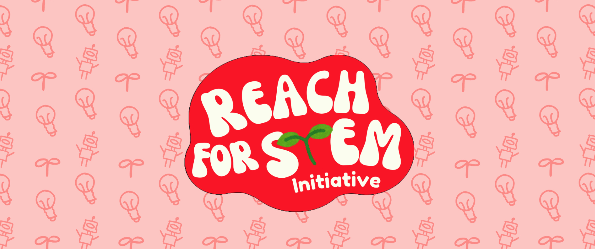

# Welcome

We are Reach for STEM Initiative, an initiative started by the Bellevue community robotics team [FTC 18225 High Definition](https://ftc18225.nw1robotics.org/), dedicated to inspiring the next generation of innovators. Our mission is to break down barriers and expand access to FIRST robotics and STEM education for students across the globe.

Founded in 2025, we are driven by a passion for giving students meaningful opportunities to learn, explore, and grow through hands-on STEM experiences.

We’re excited to share this resource with you and hope it becomes a valuable guide and source of inspiration on your team’s FLL journey!